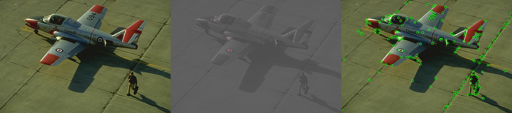

## Corner Detection - Solution Template

**NOTE:** All values and figures in this template are examples that you will need to replace with your own results

1. **Method Description.** *TODO*: In Harris detection, response can be calculated by the foluma, we just need signal.convolve2d for dx and dy, and gaussian_filter for Ixx and Iyy

2. **Precision Recall Plot.** *TODO*: Use [corner_plot.py](corner_plot.py) to add curves for the different methods that you implemented into a single plot.

   

      
   

3. **Results Table.** *TODO*: Present the performance metrics for each implementation part in a table format

   | Method | Average Precision | Runtime |
   | ------ | ----------------- | ------- |
   | Random | 0.002 | 0.001   |
   | Harris w/o NMS | 0.02 | 0.004 |
   | Harris w/ NMS | 0.49 | 0.420 |
   | Hyper-parameters tried (1) | 0.49 | 0.420 |
   | Hyper-parameters tried (2) | 0.489 | 0.71 |
   | Val set numbers of best model [From gradescope] | Harris w/ NMS | 0.501 | (gradescope didn't provide runtime) |

4. **Visualizations.** *TODO:* Include visualization on 3 images. Comment on your observations, where does your corner detector work well, where it doesn't and why? We also provided some images in [data/vis](data/vis) for testing, but you are free to use your own images as well.
   

      
   

5. **Bells and Whistles.** *TODO*: Include details of the bells and whistles that you
   tried here.

   *TODO*: Present the performance metrics for the bells and whistles in a table format

   | Method | Average Precision | Runtime |
   | ------ | ----------------- | ------- |
   | Best base Implementation (from above) | | |
   | Bells and whistle (1) [extra credit]) | | |
   | Bells and whistle (2) [extra credit]) | | |
   | Bells and whistle (n) [extra credit]) | | |
